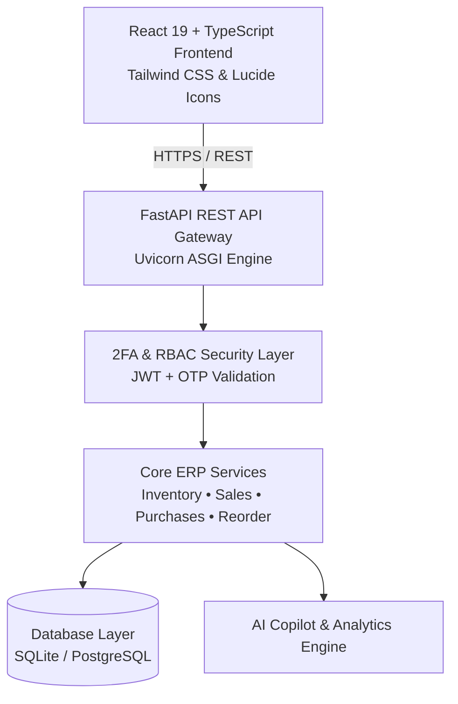

<div align="center">

# 📦 StockFlow AI
### *Next-Generation AI-Powered Inventory & Supply Chain ERP Platform*

[](https://stockflowaiapp.netlify.app)
[](https://stockflow-ai-uqxb.onrender.com/docs)
[](https://fastapi.tiangolo.com)
[](https://react.dev)
[](https://www.typescriptlang.org)
[](https://tailwindcss.com)

<br/>

**StockFlow AI** is an enterprise-grade, multi-tenant Inventory Management & Supply Chain platform engineered for modern retailers, warehouses, and distributors. It combines real-time warehouse stock synchronization, automated POS invoicing, multi-tenant company isolation, 3-tier Role-Based Access Control (RBAC), and a context-aware AI Inventory Copilot.

[🌐 **Explore Live Application**](https://stockflowaiapp.netlify.app) • [📖 **API Documentation**](https://stockflow-ai-uqxb.onrender.com/docs) • [✨ **Features**](#-core-features) • [⚡ **Quickstart**](#-local-development-setup)

</div>

---

## 🌟 Key Highlights

* 🔒 **Two-Factor Authentication (2FA) & Security**: Email OTP verification on registration, login, and self-service password recovery with timed expiry and rate limiting.
* 🏢 **Multi-Tenancy & Data Isolation**: Enterprise organization architecture where each company operates within a sandboxed catalog, customer directory, and financial ledger.
* 🛡️ **3-Tier Role-Based Access Control (RBAC)**: Fine-grained access layers separating **Company Owners (Admin)**, **Store Managers**, and **Frontline Cashiers (Staff)**.
* ⚡ **Real-Time Stock Synchronization**: Atomic transaction updates across POS sales orders, supplier purchase orders, and physical stock write-offs.
* 🧾 **Sequential Invoicing & POS Receipts**: Clean `#00001` order numbering with formatted, printable A4 Tax Invoices and thermal receipts.
* 🤖 **AI Inventory Copilot & Predictive Reordering**: Natural language inventory intelligence with heuristics forecasting depletion velocity and restock lead times.
* ⌨️ **Global Spotlight Command Palette (`Ctrl + K`)**: Instant keyboard-driven navigation, product catalog lookup, and rapid action triggers.
* 🌓 **Responsive Dark / Light Mode**: Full theme customization with persistent user preferences.

---

## 📐 System Architecture



---

## 👥 Role-Based Access Control (RBAC)

| Capability / Resource | **Admin (Owner)** | **Store Manager** | **Staff Member** |
| :--- | :---: | :---: | :---: |
| **Point-of-Sale (POS) & Sales Invoices** (`/sales`) | ✅ Full Access | ✅ Full Access | ✅ **Create & Print Invoices** |
| **Product Catalog & SKU Lookup** (`/products`) | ✅ Full Access | ✅ Full Access | ✅ **Search & View Items** |
| **Warehouse Inventory Levels** (`/inventory`) | ✅ Full Access | ✅ Full Access | ✅ **Stock Lookups** |
| **Customer Directory** (`/customers`) | ✅ Full Access | ✅ Full Access | ✅ **Register Customers** |
| **Low Stock Warnings** (`/alerts`) | ✅ Full Access | ✅ Full Access | ✅ **View Warnings** |
| **Financial Reports & Profit Margins** (`/reports`)| ✅ Full Access | ✅ Full Access | 🚫 **Restricted (403)** |
| **Vendor Purchases & Costs** (`/purchases`) | ✅ Full Access | ✅ Full Access | 🚫 **Restricted (403)** |
| **Manual Stock Adjustments** (`/stock-adjustments`) | ✅ Full Access | ✅ Full Access | 🚫 **Restricted (403)** |
| **Record Deletions (Products / Sales / Categories)** | ✅ Full Access | ✅ Full Access | 🚫 **Restricted** |
| **Master Company Settings & Team Management** (`/settings`) | ✅ Full Access | 🚫 Restricted | 🚫 **Restricted** |

---

## 🚀 Live Demo Credentials

You can test the live application immediately using either demo credentials or your own company registration:

| Account Type | Email | Password | Access Level |
| :--- | :--- | :--- | :--- |
| **Demo Admin** | `admin@example.com` | `admin123` | Full Master Control |
| **Company Owner** | `jinayshah9502@gmail.com` | `password123` | Organization Admin |
| **Staff Member** | `tanay@gmail.com` | `password123` | Frontline POS & Catalog |

> **OTP Verification Note**: On demo mode, the 6-digit OTP code is displayed right on the verification screen for instant evaluation.

---

## 💻 Tech Stack

### Frontend
- **Framework**: React 19, TypeScript
- **Bundler & Build**: Vite
- **Styling**: Tailwind CSS, Lucide Icons
- **Charts & Data Viz**: Recharts
- **PDF & Invoice Generation**: html2canvas, jsPDF, browser print styling
- **Hosting**: Netlify (Global Edge CDN)

### Backend
- **Framework**: FastAPI (Python 3.12+)
- **ORM & Database**: SQLAlchemy, SQLite (Local / Render) / PostgreSQL
- **Authentication**: Python-JOSE (JWT), Passlib / Bcrypt, Email OTP
- **Validation**: Pydantic v2
- **Hosting**: Render (Web Service)

---

## ⚡ Local Development Setup

### Prerequisites
- **Node.js**: v18.0 or higher
- **Python**: v3.10 or higher
- **Git**

---

### 1. Clone the Repository
```bash
git clone https://github.com/jinay378/StockFlow-AI.git
cd StockFlow-AI
```

---

### 2. Backend Setup
```bash
cd backend

# Create and activate virtual environment
# On Windows:
python -m venv venv
.\venv\Scripts\activate

# On macOS/Linux:
# python3 -m venv venv
# source venv/bin/activate

# Install dependencies
pip install -r requirements.txt

# Start the FastAPI server
uvicorn app.main:app --reload --port 8000
```
* Interactive API Documentation (Swagger UI): `http://127.0.0.1:8000/docs`

---

### 3. Frontend Setup
```bash
# In a new terminal window:
cd frontend

# Install npm dependencies
npm install

# Start Vite development server
npm run dev
```
* Open your browser at: `http://localhost:5173`

---

## 🌐 Production Deployment

### Frontend (Netlify)
1. Import repository on [Netlify](https://netlify.com).
2. Set **Base Directory** to `frontend`.
3. Set **Build Command** to `npm run build` and **Publish Directory** to `dist`.
4. Add environment variable: `VITE_API_BASE_URL=https://your-backend-api.onrender.com`.

### Backend (Render)
1. Create a **Web Service** on [Render](https://render.com).
2. Set **Root Directory** to `backend`.
3. Set **Build Command** to `pip install -r requirements.txt`.
4. Set **Start Command** to `uvicorn app.main:app --host 0.0.0.0 --port $PORT`.

---

## 📄 License

This project is licensed under the **MIT License** — feel free to use, customize, and extend for your business needs.

---

<div align="center">
  <sub>Built with ❤️ by <strong>Jinay Shah</strong></sub>
</div>
